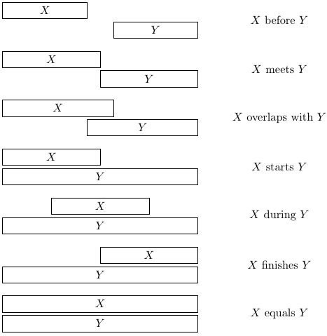

# Allen's Interval Algebra (AIA) Domain

Allen's interval algebra [[Allen, 1983](#ref-tmp-planning-allen)] is a calculus for temporal reasoning in logic that defines possible relations between time intervals. Specifically, there are seven possible relations on interval pairs `(X,Y)`. The first six relations also have an inverse, for a total of 13 unidirectional relations.

The AIA domain is a novel domain for temporal planning based on Allen's interval algebra. Specifically, the domain was designed with two goals in mind: 1) incorporate diverse forms of required concurrency, not only in the form of single hard envelopes [[Coles et al., 2009](#ref-tmp-planning-dls)]; and 2) include temporal planning instances that require simultaneous events.

To model Allen's interval algebra in PDDL, we define a single type `interval` and a function `length` on intervals that represent their duration. We also define predicates `started` and `ended` on intervals to indicate that a given interval has started or ended, predicates `nstarted` and `nended` to preserve positive preconditions, and seven predicates on interval pairs corresponding to the seven relations. For example, the binary predicate `(before ?i1 ?i2 - interval)` is used to represent the first relation.

The domain has a single action template `apply-interval` with a single argument that is an interval. The action `a_X = apply-interval(X)` associated with interval `X` has duration `d(a_X) = length(X)` and is defined as follows:

* `pre_s(a_X) = {nstarted(X)}`,
* `pre_o(a_X) = pre_e(a_X) = {}`,
* `eff_s(a_X) = {started(X), ¬nstarted(X)}`,
* `eff_e(a_X) = {ended(X), ¬nended(X)}`.

To make sure that `a_X` is only applied once, precondition `nstarted(X)` ensures that `a_X` has not previously been started. The effect at start is to add `started(X)` and delete `nstarted(X)`, and the effect at end is to add `ended(X)` and delete `nended(X)`.

We now define instances of the domain. Each instance consists of intervals `X_1, ..., X_m`, each with a given duration. Each interval `X_i`, `1 <= i <= m`, is initially marked as not started and not ended. The goal state is a series of relations on interval pairs expressed in Allen's interval algebra that we want to achieve. For example, `overlaps(X_1, X_2) /\ overlaps(X_2, X_3) /\ overlaps(X_3, X_4)`.

Given an instance of `AIA`, we compile the domain and instance into new PDDL domain and instance files. The reason is that we want to modify the individual action `a_X = apply-interval(X)` of each interval `X` depending on the desired relations in the goal state. The following table lists the modifications to actions `a_X` and `a_Y` as a result of a desired relation on intervals `X` and `Y`, in terms of additional preconditions on `a_X` and `a_Y`. We explain these modifications below.

|     Relation    |        `pre_o(a_X)`       |        `pre_s(a_Y)`       |        `pre_o(a_Y)`       |  `pre_e(a_Y)` |
|:---------------:|:-------------------------:|:-------------------------:|:-------------------------:|:-------------:|
|  `before(X,Y)`  |             -             |        `{ended(X)}`       |             -             |       -       |
|   `meets(X,Y)`  |             -             |             -             |        `{ended(X)}`       |       -       |
| `overlaps(X,Y)` |             -             | `{started(X), nended(X)}` |             -             |  `{ended(X)}` |
|  `starts(X,Y)`  |       `{started(Y)}`      |             -             |       `{started(X)}`      |  `{ended(X)}` |
|  `during(X,Y)`  |             -             |       `{started(X)}`      |             -             | `{nended(X)}` |
| `finishes(Y,X)` |       `{nended(Y)}`       |       `{started(X)}`      |       `{nended(X)}`       |       -       |
|   `equal(X,Y)`  | `{started(Y), nended(Y)}` |             -             | `{started(X), nended(X)}` | `{nended(X)}` |

* `before(X,Y)`: Action `a_X` has to end before `a_Y` starts.

* `meets(X,Y)`: Action `a_X` has to end exactly when `a_Y` starts (possibly simultaneously).
        
* `overlaps(X,Y)`: Action `a_X` has to start before `a_Y` starts, end after `a_Y` starts, and end before `a_Y` ends.

* `starts(X,Y)`: Actions `a_X` and `a_Y` have to start simultaneously (represented by contexts `started(Y)` of `a_X` and `started(X)` of `a_Y`), and `a_X` has to end before `a_Y` ends.

* `during(Y,X)`: Action `a_X` has to start before `a_Y` starts and end after `a_Y` ends.

* `finishes(Y,X)`: Actions `a_X` and `a_Y` have to end simultaneously (represented by contexts `nended(Y)` of `a_X` and `nended(X)` of `a_Y`), and `a_X` has to start before `a_Y` starts.

* `equal(X,Y)`: Actions `a_X` and `a_Y` have to start and end simultaneously.
        
With these modifications, the temporal planning instance has a plan if and only if all relations on interval pairs are satisfied, with one exception: we cannot model the relation `meets}(X,Y)` such that `Y` is forced to start at the same time as `X` ends, and `Y` starting after `X` ends also satisfies the precondition over all `ended}(X)` of `a_Y`. To model the relation `meets(X,Y)`, we use an auxiliary interval `Z` satisfying `length(Z) = length(X) + length(Y)`, `starts(X,Z)` and `finishes(Y,Z)`.

## References
* <a name="ref-tmp-planning-allen">Allen, J. F. (1983).</a> [_Maintaining Knowledge about Temporal Intervals_](https://dl.acm.org/citation.cfm?doid=182.358434). Commun. ACM 26(11):832–843.
* <a name="ref-tmp-planning-dls">Coles, A., Fox, M., Halsey, K., Long, D., and Smith, A.</a> 2009. [_Managing concurrency in temporal planning using planner-scheduler interaction_](https://www.sciencedirect.com/science/article/pii/S0004370208000994). Artif. Intell. 173(1):1–44.
